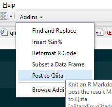
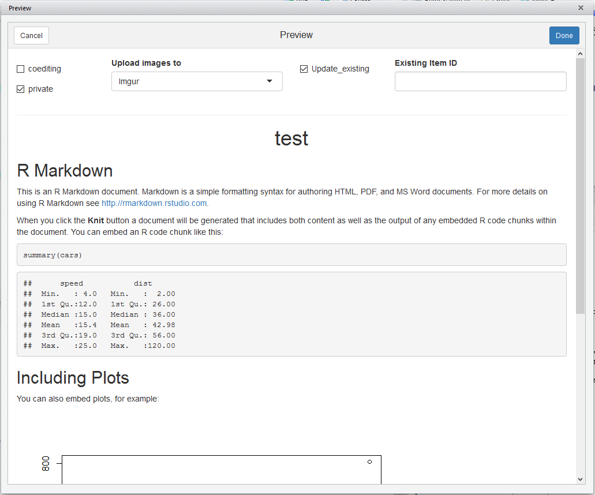

RStudio Addin to Post to Qiita
==============================

*Caution: This package is in the verrry early stages.*

### Installation

```r
library(devtools)
install_github("yutannihilation/qiitaddin")
```

### Preperation

#### Qiita access token

See: https://github.com/yutannihilation/qiitr#preperation

#### Imgur or Gyazo account

Since no method to upload image is provided by Qiita API, this package upload images to [Imgur](https://imgur.com/) or [Gyazo](https://gyazo.com/). Though Imgur allows us to upload images anonymously, I recommend you to create an acount on either service, since those images uploaded without the owner cannot be deleted afterwards (as this package won't record the `deletehash`). 
You have been warned!

### Usage

After making sure that the target R Markdown file is active, click "Post to Qiita".



You can also type the command in your console.

```r
qiitaddin::qiitaddin_knit("path/to/file.Rmd")
```

After knitting the document is finished, the preview window appears. Review the document and edit the following items if necessary.

* `coediting`: A flag whether this item is co-edit mode (only available on Qiita:Team).
* `private`: A flag whether this item is private (only available on Qiita).
* `gist`: A flag to post data to Gist (only available if GitHub integration is enabled).
* `tweet`: A flag to post a tweet (only available if Twitter integration is enabled).
* `Upload images to`: Which service to upload images to. Currently, Imgur and Gyazo are supported.




When things are done, click "Done". (If you don't set `QIITA_ACCESSTOKEN` environmental variable, you will be asked to provide your Qiita access token)


After that, the document is posted to Qiita and you will jump to the page.

Note that there are one important thing you have to be careful about:

* Qiita is more formal place than Rpubs; Qiita people may get mad at you if you publish some test document that is not for sharing your knowledge, but for just testing Qiita API and this package. Never make it public.
